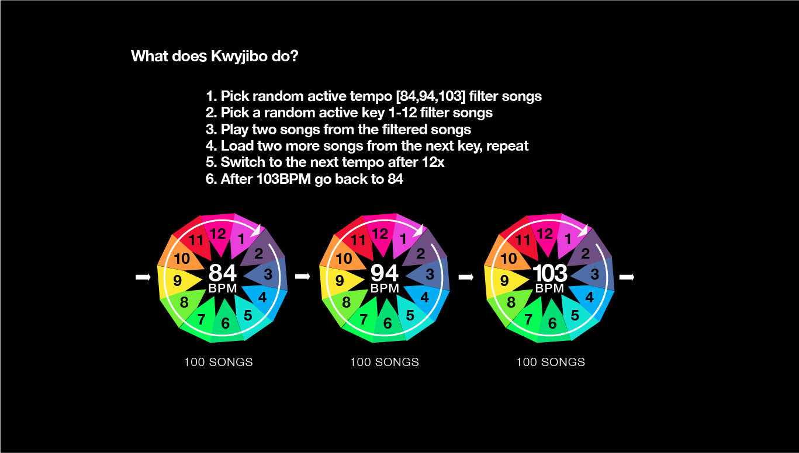
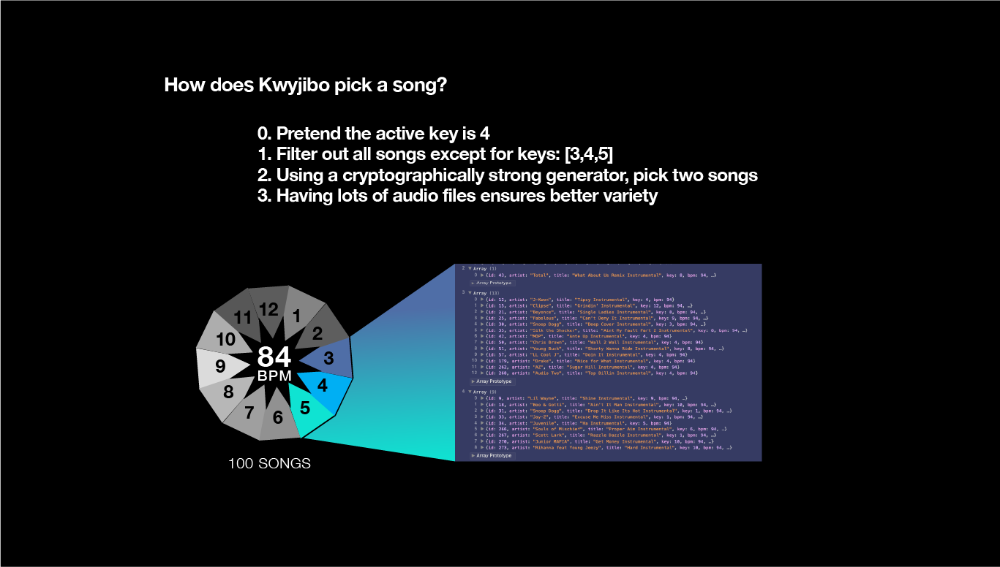
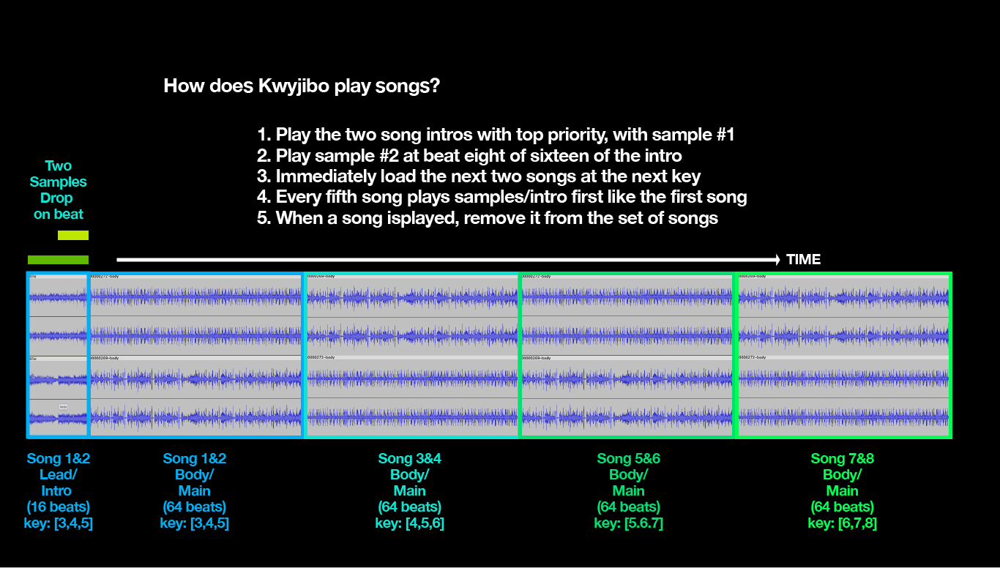

# Kwyjibo

Example output posted to soundcloud: https://soundcloud.com/cappinkirk/kdefv1

LIVE JavaScript DJ Website dynamically powered by Kwyjibo: https://cappinkirk.com

[YouTube How to Use KWYJIBO](https://studio.youtube.com/video/61mAf_8swEE/edit)
A rambling, unedited, 55-minute video that talks about the functionality, walks through some of the code, and shows how to make audio files for the program. Grab a root beer and hunker down.

## How does it work on https://cappinkirk.com ?

The application has a bunch of audio files (specifically in 84, 94, and 103 BPM tempos) that are each 16 and 64 beats in length (two files, 'lead' and 'body'), for each of 273 songs that have an object describing their native integer tempo, artist name, title, and key.

Kwyjibo randomly selects forward or reverse key traversal order, selects a random tempo (84, 94, 103), and a random key (1-12) to start. Next, it filters the set of songs to the tempo and key* and randomly chooses one, and removes this from the list of songs. It gets two songs going in matching tempo with near or matching keys for 16 beats while playing two DJ samples at specific times, chosen randomly from a bank of sounds created for this purpose.

Next it plays a longer version of those two songs for 64 beats. For the next four songs, just play the longer versions, but also just like before, filter songs, choose one randomly, remove from list. Each chosen song moves the active key value ahead, forward or reverse, and when it overflows it goes back to the bottom/top (forward/reverse).

If a song isn’t available in the key search, just randomly choose any song and remove it from the list (this rarely happens, contrary to my expectation). At an index specified, change to the next tempo and run the same program.

* when considering key the metadata also includes specific information not only about the entire instrumental (native key) but also the time shifted key, if it is affected. this allows for more complex combinations of beats

## What were the main challenges with this project?

The first challenge was getting the audio to play simultaneously to create a POC. I know that setTimeout and normal JavaScript clock isnt accurate enough for precise timing and I didnt want the application to feel "off". So the first day was spent coming up with a good way to get two audio files to play at the same time.

I was also concerned about the loading and decoding times for mp3 files, and definitely worried about loading times for wav files, so locally when I record I use wav and when I publish to the web I use mp3 format.

Next my POC worked with about four songs all at the same tempo but it didn't work on mobile and also it loaded all the songs on page load which was undesirable. I wasn't in a hurry to get the product finished so the solution came to me naturally in between coding sessions, to just load one set of songs, and then once it is loaded load the next set of songs, ad infinitium. This way there was only one next set of tracks cued up at a given time and saved a lot of bandwidth.

After that I focused on getting it to work on mobile which seemed impossible on iOS until I figured out the most important trick, I didn't find my solution on the web I figured it out on my own.

Now it works pretty great except for the phone going to sleep which iI really am not concerned with enough to fix yet, although I have some creative ideas. I prefer to encourage people to use the desktop version anyway.

## How do I use my own songs with the project?

Recording an entire song at your tempo, exactly 94.00 BPM for example, isn't always easy. Many songs are not "metric" at all, either not 4/4 or not consistently 4/4 or whatever. Pretend you only care about songs that can be perfectly gridded.

So pretend that you are able to perfectly grid a song at a single bpm for 16 and 64 beats (lead and body files). You also need to line up the song so that the bass or snare matches up with another song correctly. Many songs have swing or offbeat or jazzy bass. This requires listening, just like a DJ does live but in a quiet studio enrollment its much more controlled and easier in addition to being more accurate. Now you can templatize your process in Audacity for your tempo and begin stamping out tracks.

To accomplish this task I exported a rhythm from DJ-505 drum machine set to 94.0BPM with sync on. I use the exported beat to match each track to so I can listen to how the beats match up and twiddle if needed. After I like the sound I can export the files. The drum machine isnt present on the recorded tracks, but it exists in my Audacity template for lining up beats visually before and during listening.

I also use an Audacity macro that normalizes the volume on the tracks to be safe for general broadcast and saves mp3 and wav versions from a wav source.

## What's next for this project?

I have an awesome dance version that plays entire Billboard Rhythmic Dance songs mixed together, but its just for me to listen to at home, that uses 123BPM files. I'd like to also add the ability to include shorter loops that wrap around for the duration of the longer track, and also to make some native apps based on this technology.

Once it's set up, a club or DJ could use this to get their set going or to take a break, or a rapper could use it to rap over beats, there are lots of application ideas to use in the future, and of course adding new music which I could make an entire workshop about, maybe on youtube.

DJing is really fun but "not DJing" is even more fun 😃 especially when I hear the "creations" of this algorithm, sometimes they give the chills!

Check out https://cappinkirk.com for endless on-key mixes